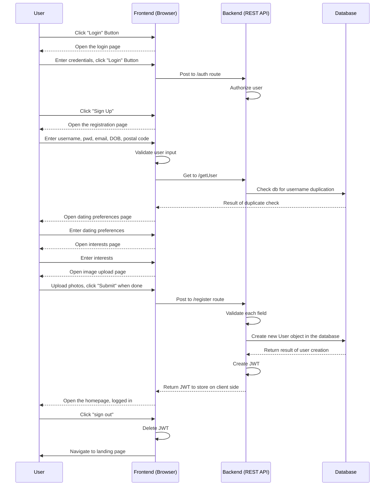

```mermaid
sequenceDiagram
User->>Frontend (Browser): Click "Login" Button
Frontend (Browser)-->>User: Open the login page
User->>Frontend (Browser): Enter credentials, click "Login" Button
Frontend (Browser)->>Backend (REST API): Post to /auth route
Backend (REST API)->>Backend (REST API): Authorize user
User->>Frontend (Browser): Click "Sign Up"
Frontend (Browser)-->>User: Open the registration page
User->>Frontend (Browser): Enter username, pwd, email, DOB, postal code
Frontend (Browser)->>Frontend (Browser) : Validate user input
Frontend (Browser)->>Backend (REST API) : Get to /getUser
Backend (REST API)->>Database : Check db for username duplication
Database-->>Frontend (Browser) : Result of duplicate check
Frontend (Browser)-->>User : Open dating preferences page
User->>Frontend (Browser): Enter dating preferences
Frontend (Browser)-->>User : Open interests page
User->>Frontend (Browser): Enter interests
Frontend (Browser)-->>User : Open image upload page
User->>Frontend (Browser): Upload photos, click "Submit" when done
Frontend (Browser)->>Backend (REST API): Post to /register route
Backend (REST API)->>Backend (REST API): Validate each field
Backend (REST API)->>Database: Create new User object in the database
Database-->>Backend (REST API): Return result of user creation
Backend (REST API)->> Backend (REST API): Create JWT
Backend (REST API)-->>Frontend (Browser): Return JWT to store on client side
Frontend (Browser)-->>User: Open the homepage, logged in
User->>Frontend (Browser): Click "sign out"
Frontend (Browser)->>Frontend (Browser): Delete JWT
Frontend (Browser)->>User: Navigate to landing page
```