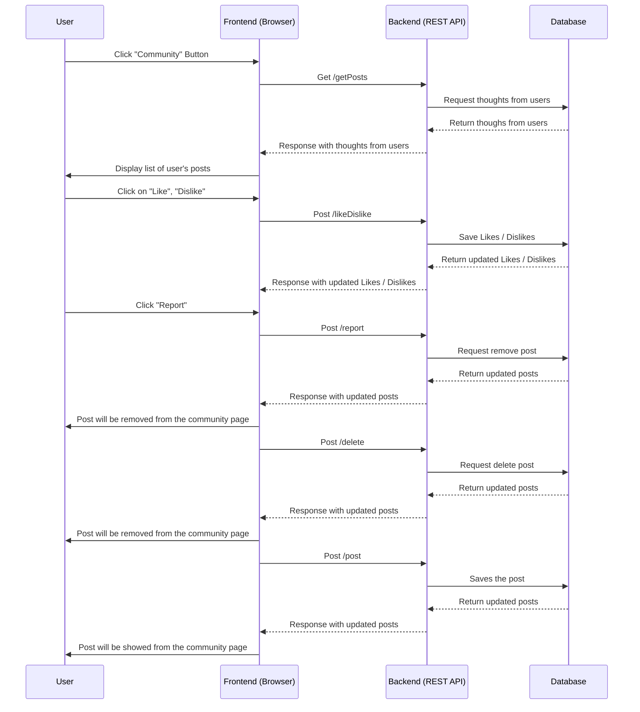

```mermaid
sequenceDiagram
	User->>Frontend (Browser): Click "Community" Button
    Frontend (Browser)->>Backend (REST API): Get /getPosts
    Backend (REST API)->>Database : Request thoughts from users
    Database-->>Backend (REST API) : Return thoughs from users
    Backend (REST API)-->>Frontend (Browser) : Response with thoughts from users
    Frontend (Browser)->>User : Display list of user's posts
    User->>Frontend (Browser): Click on "Like", "Dislike"
    Frontend (Browser)->>Backend (REST API): Post /likeDislike
    Backend (REST API)->>Database : Save Likes / Dislikes
    Database-->>Backend (REST API) : Return updated Likes / Dislikes
    Backend (REST API)-->>Frontend (Browser) : Response with updated Likes / Dislikes
    User->>Frontend (Browser): Click "Report"
    Frontend (Browser)->>Backend (REST API): Post /report
    Backend (REST API)->>Database : Request remove post
    Database-->>Backend (REST API) : Return updated posts
    Backend (REST API)-->>Frontend (Browser) : Response with updated posts
    Frontend (Browser)->>User: Post will be removed from the community page
    Frontend (Browser)->>Backend (REST API): Post /delete
    Backend (REST API)->>Database : Request delete post
    Database-->>Backend (REST API) : Return updated posts
    Backend (REST API)-->>Frontend (Browser) : Response with updated posts
    Frontend (Browser)->>User: Post will be removed from the community page
    Frontend (Browser)->>Backend (REST API): Post /post
    Backend (REST API)->>Database : Saves the post
    Database-->>Backend (REST API) : Return updated posts
    Backend (REST API)-->>Frontend (Browser) : Response with updated posts
    Frontend (Browser)->>User: Post will be showed from the community page

```