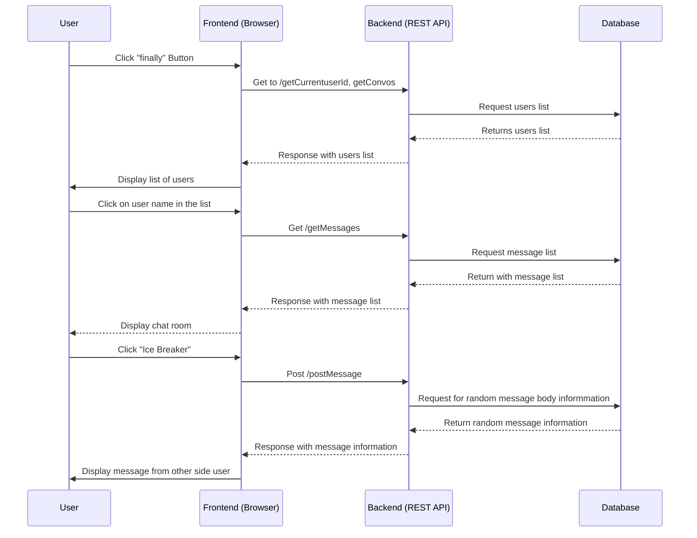

```mermaid
sequenceDiagram
	User->>Frontend (Browser): Click "finally" Button
    Frontend (Browser)->>Backend (REST API): Get to /getCurrentuserId, getConvos
    Backend (REST API)->>Database : Request users list
    Database-->>Backend (REST API) : Returns users list
    Backend (REST API)-->>Frontend (Browser) : Response with users list
    Frontend (Browser)->>User : Display list of users
    User->>Frontend (Browser): Click on user name in the list
    Frontend (Browser)->>Backend (REST API): Get /getMessages
    Backend (REST API)->>Database : Request message list
    Database-->>Backend (REST API) : Return with message list
    Backend (REST API)-->>Frontend (Browser) : Response with message list
    Frontend (Browser)-->>User: Display chat room 
    User->>Frontend (Browser): Click "Ice Breaker"
    Frontend (Browser)->>Backend (REST API): Post /postMessage
    Backend (REST API)->>Database : Request for random message body informmation
    Database-->>Backend (REST API) : Return random message information
    Backend (REST API)-->>Frontend (Browser) : Response with message information
    Frontend (Browser)->>User: Display message from other side user 
```