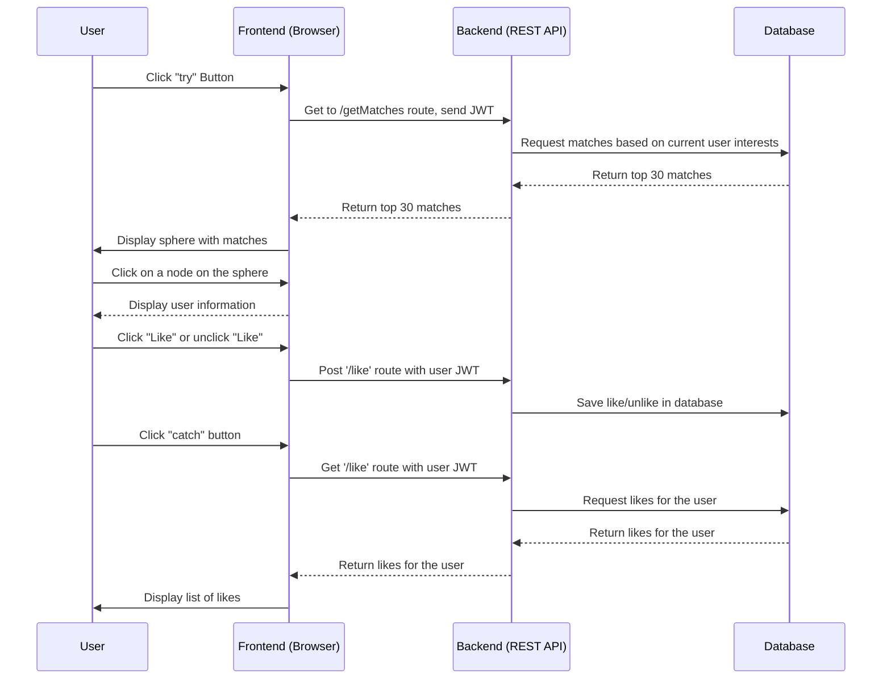

```mermaid
sequenceDiagram
	User->>Frontend (Browser): Click "try" Button
    Frontend (Browser)->>Backend (REST API): Get to /getMatches route, send JWT
    Backend (REST API)->>Database : Request matches based on current user interests
    Database-->>Backend (REST API) : Return top 30 matches
    Backend (REST API)-->>Frontend (Browser) : Return top 30 matches
    Frontend (Browser)->>User : Display sphere with matches
    User->>Frontend (Browser): Click on a node on the sphere
    Frontend (Browser)-->>User: Display user information 
    User->>Frontend (Browser): Click "Like" or unclick "Like"
    Frontend (Browser)->>Backend (REST API): Post '/like' route with user JWT
    Backend (REST API)->>Database : Save like/unlike in database 
    User->>Frontend (Browser): Click "catch" button 
    Frontend (Browser)->>Backend (REST API): Get '/like' route with user JWT
    Backend (REST API)->>Database : Request likes for the user 
    Database-->>Backend (REST API): Return likes for the user 
    Backend (REST API)-->>Frontend (Browser): Return likes for the user 
    Frontend (Browser)->>User: Display list of likes 
```