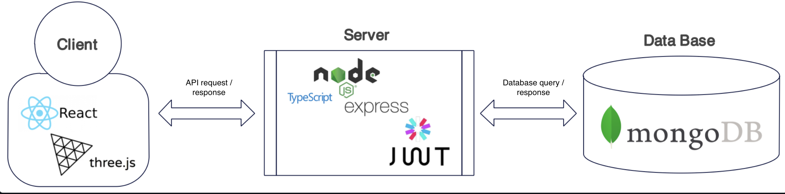

# cachingFeelings {❤️}

## About Us

###  Team Members
| Name | GitHub Username | Email
| --- | --- | --- |
| Breanna Brown | bre9425 | millettb@myumanitoba.ca
| Oluwademilade Akinsola | Demi-AK | akinsol2@myumanitoba.ca
| Heejeong Kim | Heejoy | kimh4@myumanitoba.ca
| Rahul Kumar | bochacho | kumarr7@myumanitoba.ca
| Dingyuan Zhang | AllNEWAREAS | zhangd7@myumanitoba.ca

###  Team Leader:
| Name | GitHub Username | Email
| --- | --- | --- |
| Breanna Brown | bre9425 | millettb@myumanitoba.ca

## Project Proposal

### Vision
Caching Feelings is more than just an application; it's a transformative experience for computer science enthusiasts. 
We want to foster a safe environment where like-minded individuals can connect. The ultimate goal is to facilitate lasting, 
meaningful relationships that will eventually extend beyond the comforts of the digital realm.

### Summary
Caching Feelings is an innovative web app designed specifically for computer science enthusiasts, aiming to revolutionize how they connect and interact to enter relationships. 
The app features a robust and user-friendly registration process where students can create a personalized profile using their email. 
Profiles include essential details like username, picture, birthday, gender, interests, and academic focuses, such as GitHub repositories or preferred coding languages, 
enhancing the matchmaking experience. Users will also be provided with the option to remain anonymous or provide their name and photos.

At the heart of Caching Feelings is its (Soul) Matching system. It's tailored to help students find matches based on not just proximity and age range but also shared tech interests and academic goals. 
This ensures that connections are meaningful and based on common passions.

The app excels in communication, offering messaging options, and organized chats for ongoing conversations. This fosters deeper connections among users. 
The Community Discovery feature allows students to share thoughts, engage with posts, and maintain a safe, respectful community by reporting inappropriate content.

Caching Feelings also offers extensive customization options, including light and dark modes, password change, and anonymous browsing. The integration with GitHub showcases the app's focus on academic achievements and tech skills. Overall, the app aims to make university life for computer science students more connected, less stressful, and intellectually rich, bridging the gap between personal and professional development.

### Stakeholders
The primary end user of this app will be any individual that has an interest in computer science and is familiar with the terminology and is looking for a partner that shares the same interests.
This includes: 
> * Students 
> * TAs
> * Professors 
> * CS Alumni
> * Working professionals in the tech industry 

Another subset of users is those that shy away from traditional dating apps due to social anxiety or because of a more introverted personality. 
This app will provide a safe space for them to put themselves out there and meet like-minded individuals. 

### Technologies
> * MongoDB
> * React
> * ExpressJS
> * NodeJS
> * JSON Web Tokens
> * Three.JS

### Core Features
> * Account Creation
> * Student (Soul) Matching
> * Interact with Matches
> * Community Discovery
> * Icebreakers
> * Non-functional Secure Authentication

### Architecture Design

## Collaboration Tools

- **Github**: Our team primarily uses github for the following:
    - Version Control: ...duh
    - Progress Tracking: We use the Issues tab to assign tasks and keep track of the milestones for each sprint.
    - Meeting Notes: We keep track of all the meeting notes in GitHub under the Wiki tab.
        - [Group Meetings](https://github.com/bre9425/COMP4350/wiki/Group-Meetings) 
        - [TA Meetings](https://github.com/bre9425/COMP4350/wiki/TA-Meetings)
- **Discord**: The primary tool for communication outside of class.
- **Whatsapp & Email**: To organize meeitngs with our TA
- **Miro**: A whiteboard tool to brainstorm ideas and design the architecture of the software
- **Google Docs**: To collectively edit a document before we write the final version on RMD in g

## Meeting Notes

Meeting Notes can be found under the Wiki Tab of GitHub or you can just click the link below
- [Group Meetings](https://github.com/bre9425/COMP4350/wiki/Group-Meetings) 
- [TA Meetings](https://github.com/bre9425/COMP4350/wiki/TA-Meetings)
